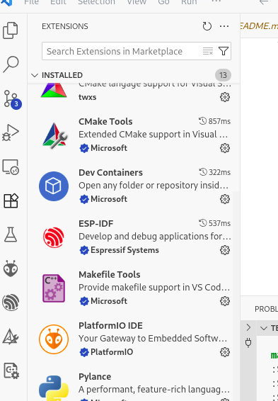
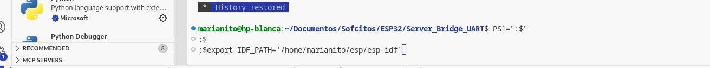
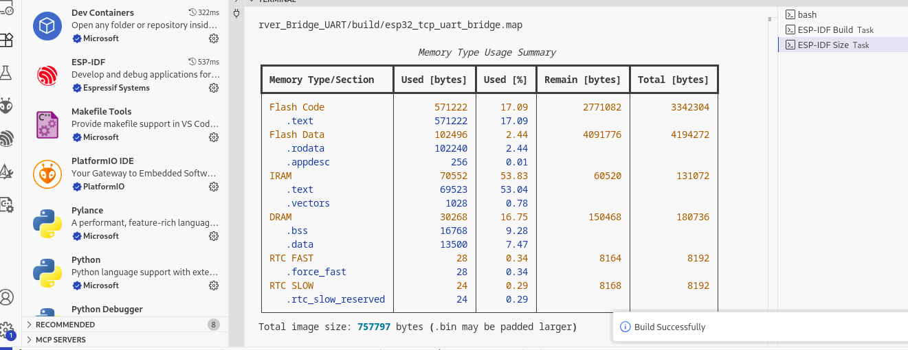
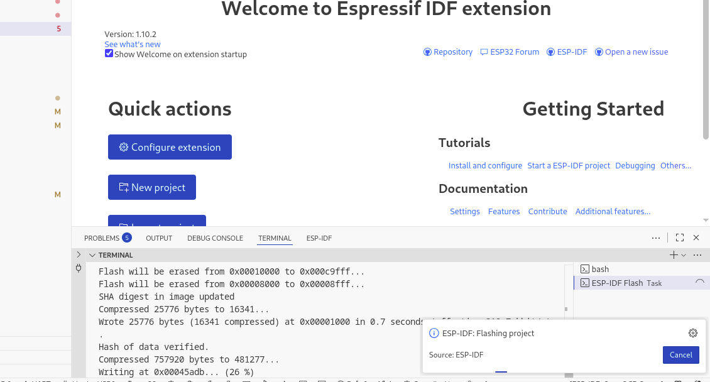
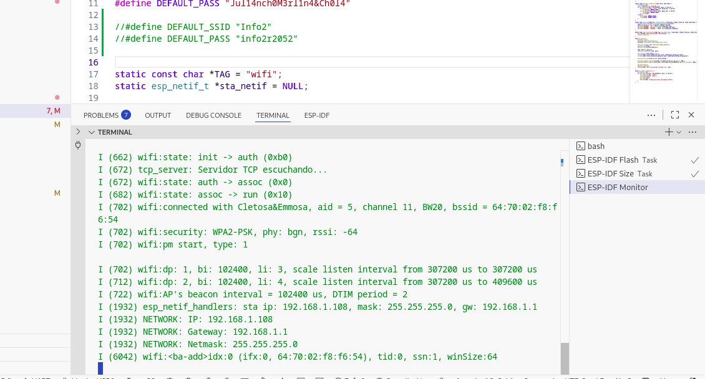
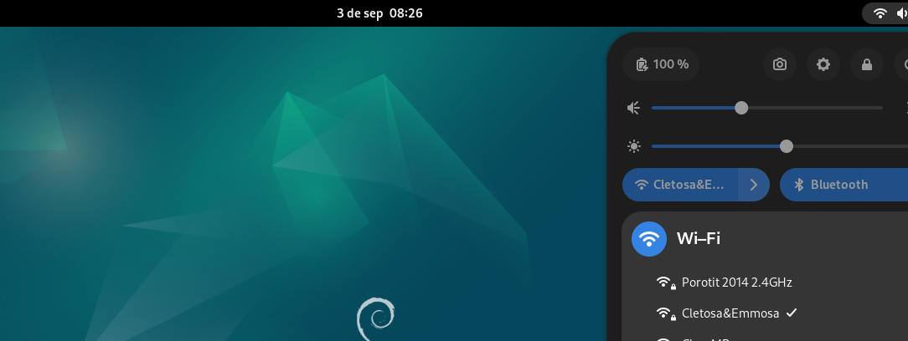
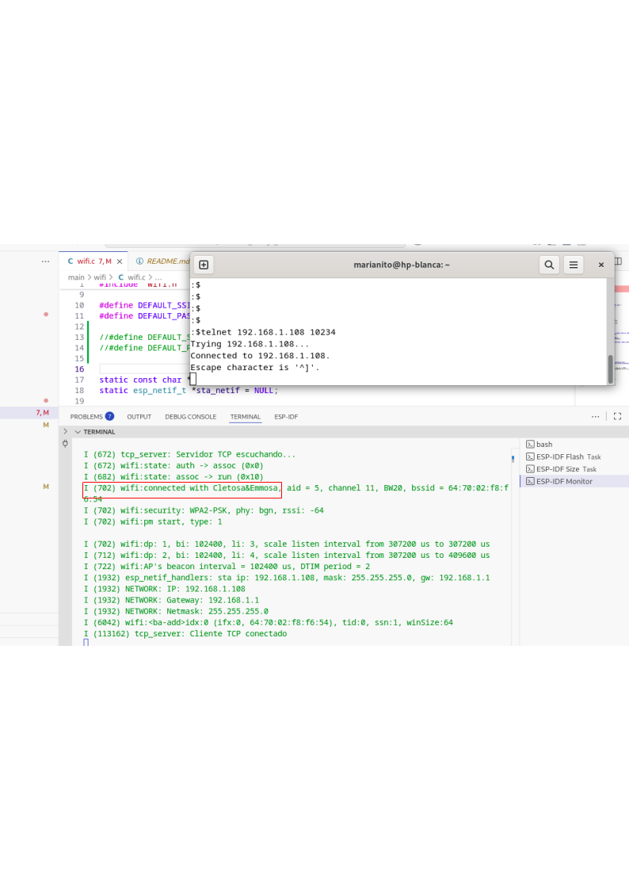
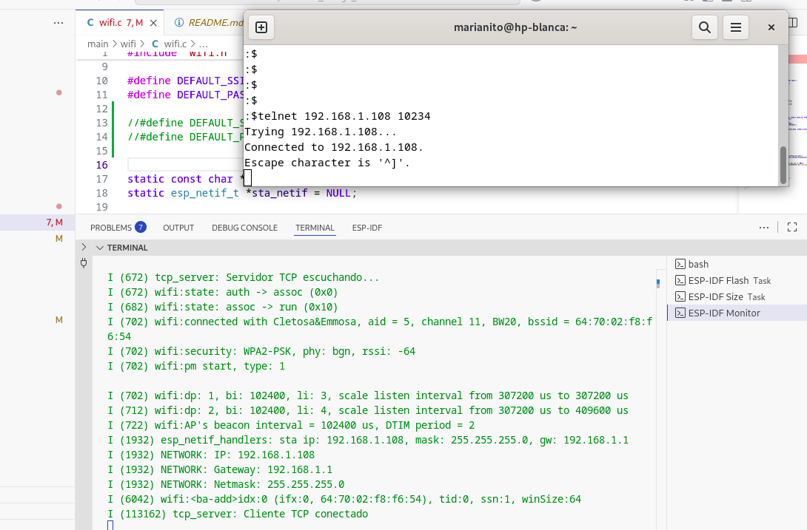

# 🥤 Demo ESP32 Bridge UART TCP

## Requisitos

### 1. Plugin ESP-IDF
 

### 2. Variables de entorno
Exportar variables de entorno para poder utilizar los botones que vienen con VS code al instalar el plugin ESP-IDF

Ejemplo:
export IDF_PATH='/home/marianito/esp/esp-idf'

### 3. Botones build, flash y monitor VS Code

### 4. Compilación

### 5. Grabar ESP-32

### 6. Monitorear APP

### 7. Chequear misma LAN PC y ESP-32

### 8. Prueba cliente TCP via terminal

